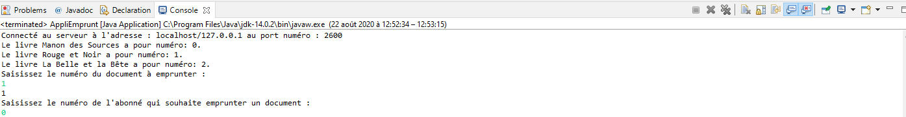
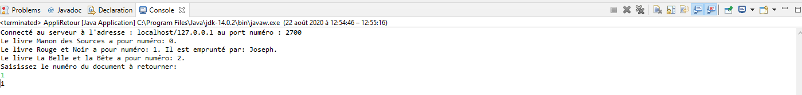
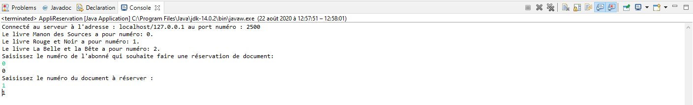
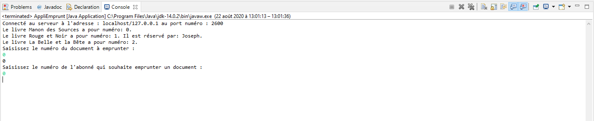

# Projet programmation Web - Serveur (Programmation concurrente)

## Présentation du projet

Le projet a pour objectif de gérer grâce à un serveur les réservations, les emprunts et les retours de documents d’une bibliothèque.

Ce projet utilise la programmation concurrente car les documents sont des ressources partagées qui peuvent à l’origine de conflits entre les différents services possible dans la bibliothèque. Afin d’éviter d’éventuels conflits l’accès aux ressources partagées les sections critiques ont été verrouillés au niveau de la bibliothèque qui va se charger de gérer l’accès aux ressources par les clients. Les verrous se trouvent dans la bibliothèque afin de simplifier l’ajout d’éventuels nouveaux services. 

### Côté Client
Il y a un client pour chaque service possible dans un bibliothèque c’est-à-dire un client qui emprunte un document, un autre pour faire la réservation d’un document emprunté, enfin un client pour retourner un livre emprunté. Chaque client sera représenté par un socket par laquelle il pourra accéder au serveur en entrant le port et l’hôte du serveur lié au service demandé par le client.

### Côté Serveur
Il y a autant de serveurs que de services disponibles dans la bibliothèque. En fonction du port de connexion du client , le serveur va se charger de rediriger le client vers le serveur adapté à son port. Les serveurs dans ce projet tournent en boucle car on considère que tout fonctionne 24h/24. Pour la conception de classe bibliothèque le design pattern Singleton a été utilisé car on considère que les services sont disponibles uniquement dans une seule bibliothèque.

### Bibliothèque
Il y a une seule et unique bibliothèque qui est chargé de gérer les emprunts, les réservations et les retours de documents en fonction de son type et les éventuelles erreurs qui peuvent se produire au cours d’un emprunt, d’une réservation ou d’un retour.

## Répartition des packages

### Le package bibliotheque

Contient les classes permettant de gérer les abonnés, les documents, les emprunts, les retours, les réservations, ainsi que les exceptions associés à certaines de ces classes.

### Le package client

Contient les classes clientes qui se connectent au serveur afin d'emprunter un document, réserver un document ou bien retourner un document.

### Le package serveur

Contient les classes serveur permettant de gérer les services disponible dans la bibliothèque.

# Démonstration du projet

Tout d'abord il faut exécuter la classe AppliServeur qui lance l'ensemble des serveurs.

Ensuite l'utilisateur a le choix entre 3 services : emprunter, réserver ou retourner un document.

## Emprunt d'un document

## Retour d'un document

## Réservation d'un document

## Réservation d'un document (Affichage de la disponibilité d'un document)

